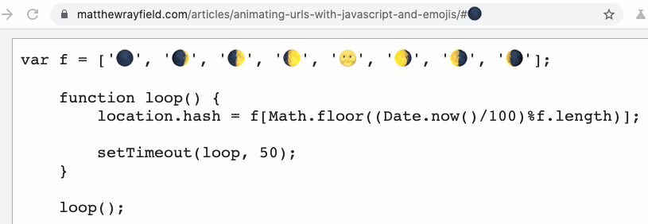
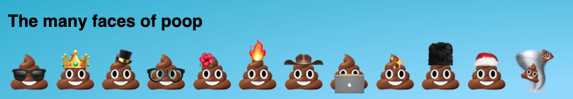
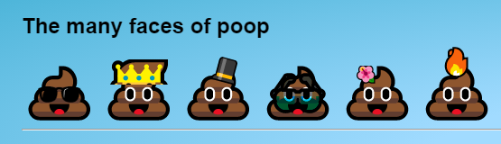
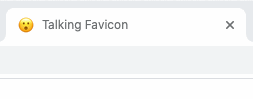
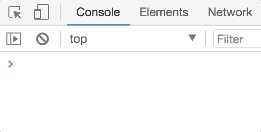
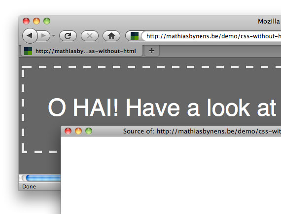

<p>The front of the front end is powerful and these days developers can do things that couldn't be imagined a couple of years ago. Or could be? I remember times when CSS was very limited but one way or another a lot could be achieved. And I have a feeling that in reality imagination is the limitation part, not the technology. And having fun is an integral part of the process.</p>

<p>While browsing through different articles sometimes I meet those that I would call ‘crazy'. Those where developers try something just because it's fun. Technologies behind a development preview flag, something specific to a browser, something that can be achieved easily with a different approach, something that people do just because they can.</p>

<p>And here I gathered some of these tricks for you. Some of the approaches are actually quite useful for specific requests, some are just fooling around. But all of them are really simple, cool and fun (and thus somehow impressive for me). I hope you'll like them.</p>

<h2>Animation URLs with javascript and emojis</h2>

<p>https://matthewrayfield.com/articles/animating-urls-with-javascript-and-emojis/</p>



<p>With javascript, we can change a page URL, and the part after # can be changed actually without redirecting anywhere. So placing ASCII symbols there or emojis we can draw funny animations. Pretty cool for a home project but I also can imagine it on a more serious project</p>

<h2>Split emoji text effect with CSS</h2>

<div class="snippet">
            <p class="codepen" data-height="265" data-theme-id="light" data-default-tab="result" data-user="mandymichael" data-slug-hash="mWXGZp" style="height: 265px; box-sizing: border-box; display: flex; align-items: center; justify-content: center; border: 2px solid; margin: 1em 0; padding: 1em;" data-pen-title="Split emoji text effect with css">
  <span>See the Pen <a href="https://codepen.io/mandymichael/pen/mWXGZp">
  Split emoji text effect with css</a> by Mandy Michael (<a href="https://codepen.io/mandymichael">@mandymichael</a>)
  on <a href="https://codepen.io">CodePen</a>.</span>
            </p>
            <script async src="https://cpwebassets.codepen.io/assets/embed/ei.js"></script>
</div>


<p>This one is fun. Overflow: hidden, some clip-path and we can cut emojis, combine particles, create crazy combinations. Pure joy.</p>

<figure>
    
</figure>

<p>Unfortunately emoji change from platform to platform, but compared to Windows, the results aren't terrible.</p>

<figure>
    
</figure>

<h2>The talking favicon in 256 bytes</h2>

<p>So, as you already might hear, almost all the browsers now support SVG favicons. A brilliant developer Lea Verou showed a really easy way to create a favicon from an emoji (if you're too lazy to create a special one).</p>

<div class="snippet">
            <blockquote class="twitter-tweet"><p lang="en" dir="ltr">Now that all modern browsers support SVG favicons, here&#39;s how to turn any emoji into a favicon.svg:<br><br>&lt;svg xmlns=&quot;<a href="https://t.co/TJalgdayix">https://t.co/TJalgdayix</a>&quot; viewBox=&quot;0 0 100 100&quot;&gt;<br>&lt;text y=&quot;.9em&quot; font-size=&quot;90&quot;&gt;💩&lt;/text&gt;<br>&lt;/svg&gt;<br><br>Useful for quick apps when you can&#39;t be bothered to design a favicon! <a href="https://t.co/S2F8IQXaZU">pic.twitter.com/S2F8IQXaZU</a></p>&mdash; Lea Verou (@LeaVerou) <a href="https://twitter.com/LeaVerou/status/1241619866475474946?ref_src=twsrc%5Etfw">March 22, 2020</a></blockquote> <script async src="https://platform.twitter.com/widgets.js" charset="utf-8"></script>
        </div>


<p>Second fun fact about the technique is that we don't need a separate file — we can just write</p>


``` html
    <link rel="icon" href="data:image/svg+xml,<svg xmlns='http://www.w3.org/2000/svg' viewBox='0 0 100 100'><text y='.9em' font-size='90'>💩</text></svg>">

```

<p>And with a short piece of javascript the favicon gets an animated emoji 😎</p>

``` html
    <body onload="setInterval(_=>i.href=`data:image/svg+xml,<svg xmlns='http://www.w3.org/2000/svg' viewBox='0 0 16 16'><text y='14'>${[...'😮😀😁😐😑😬'][++x%6]}</text></svg>`,x=9)">

```

<div class="snippet">
        <blockquote class="twitter-tweet"><p lang="en" dir="ltr">The talking favicon in 256 bytes:<a href="https://t.co/DpGnPe5OTy">https://t.co/DpGnPe5OTy</a><br><br>Source:<br><br>&lt;link rel=icon id=i&gt;<br>&lt;body onload=&quot;setInterval(_=&gt;i.href=&grave;data:image/svg+xml,&lt;svg xmlns=%27http://www.w3.org/2000/svg&#39; viewBox=&#39;0 0 16 16&#39;&gt;&lt;text y=&#39;16&#39;&gt;&dollar;{[...&#39;😮😀😁😐😑😬&#39;][&plus;&plus;x&percnt;6]}&lt;/text&gt;&lt;/svg&gt;&grave;,x&equals;9)&quot;&gt; <a href="https://t.co/0RlhqeluId">pic.twitter.com/0RlhqeluId</a></p>&mdash; Martin Kleppe (@aemkei) <a href="https://twitter.com/aemkei/status/1242211870448259072?ref_src=twsrc%5Etfw">March 23, 2020</a></blockquote>
</div>

<figure>
    
</figure>

<p><strong>Bonus</strong></p>

<p>These cute animations reminded me of something very old. Very old, very useless but so cool. This library (http://lab.ejci.net/favico.js/) allows you to play video within a favicon (yay, one step to Doom) o_O. How crazy is that?</p>


<h2>JS in CSS</h2>

<p>We already had JS in CSS once (remember filters functions in IE?) but here we're talking about something else. The idea is simple — storing JS string in CSS native variables, we can execute them and thus understand in which file we're currently. This, for example, gives us the possibility to save something in local storage to be able to interact with CSS again using the saved information. Or something else crazy :)</p>

https://juwain.dev/posts/js-in-css-2/

<figure>
    
    <figcaption>Credits: juwain.dev</figcaption>
</figure>

<h2>Using CSS without HTML</h2>

<p>The craziest techniques. I guess it's more about knowing the principles of browsers work, which is definitely an important skill in our profession. But also having pure, not ready for production fun🙂</p>

<p>https://css-tricks.com/using-css-without-html/</p>

<p>Apparently, some browsers understand a special HTTP Header Link, in which we can pass CSS code without an actual CSS file. And CSS already can contain everything, including meaningful text content in pseudo-elements.</p>

<figure>
    
    <figcaption>Credits: csstricks.com</figcaption>
</figure>

<p>And here there is a nice example of what can be done in CSS without a line of HTML. Everything is easy, I just keep forgetting that a lot of stuff can be put directly into CSS notation.</p>

<div class="snippet">
            <p class="codepen" data-height="297" data-theme-id="light" data-default-tab="result" data-user="ainalem" data-slug-hash="oNxXRgW" style="height: 297px; box-sizing: border-box; display: flex; align-items: center; justify-content: center; border: 2px solid; margin: 1em 0; padding: 1em;" data-pen-title="CSS is Awesome">
  <span>See the Pen <a href="https://codepen.io/ainalem/pen/oNxXRgW">
  CSS is Awesome</a> by Mikael Ainalem (<a href="https://codepen.io/ainalem">@ainalem</a>)
  on <a href="https://codepen.io">CodePen</a>.</span>
            </p>
</div>

<p>If you know some similar examples of fun, please share. After all what else for we need Fridays ;)</p>
